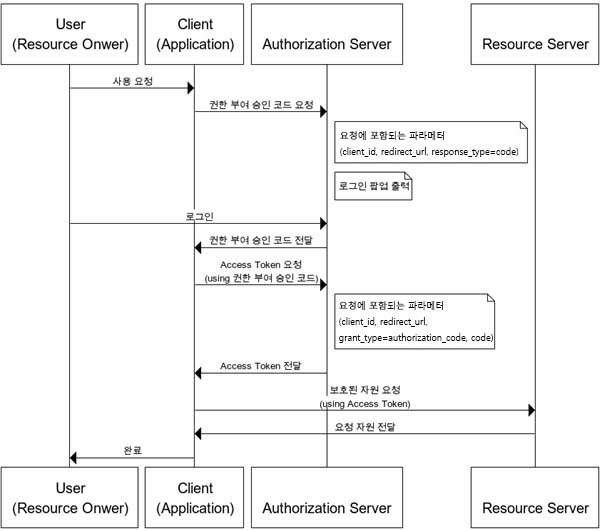

# OAuth
+ 웹 및 애플리케이션 인증 및 권한 부여를 위한 개방형 표준 프로토콜
+ third-party 애플리케니션이 사용자의 리소스에 접근하기 위한 절차를 정의
+ 서비스 제공자의 API를 사용할 수 있는 권한을 부여
  + Ex. 네이버 로그인, 구글 로그인

---

## OAuth 역할
+ 리소스 소유자 (Resouce Owner)
  + 리소스에 대한 엑세스 권한을 부여하는 사용자(엔티티)
  + 클라이언트 인증(Authorize)하는 역할을 수행
  + 네이버 로그인에서 네이버 아이디를 소유하고 third-party 애플리케이션(클라이언트)에  네이버 아이디로 소셜 고르인 인증을 하는 사용자를 의미한다
+ 클라이언트 (Client)
  + OAuth를 사용하여 리소스에 접근하려는 third-party 애플리케이션이나 서비스
+ 권한 서버 (Authorization Server)
  + 권한 서버는 클라이언트가 리소스 소유자의 권한을 얻을 수 있도록 도와주는 서버
  + 권한 서버는 사용자 인증, 권한 부여 및 토큰 발급을 관리한다
+ 리소스 서버 (Resource Server)
  + 보호되는 리소스를 호스팅하는 서버
  + 엑세스를 허용하거나 거부한다
  + OAuth 토큰을 사용하여 클라이언트에게 리소스에 엑세스할 권한을 부여하고 실제 데이터를 제공한다

---

## OAuth 용어
+ 엑세스 토큰 (Access Token)
  + 클라이언트가 리소스 서버의 리소스에 접근하기 위한 권한을 부여받는 토큰
  + 엑세스 토큰은 권한 서버로부터 발급된다
  + 제한된 유효 기간을 가지고 있다
+ 리프레시 토큰 (Refresh Token)
  + 엑세스 토큰의 유효 기간이 만료된 후 새로운 엑세스 토큰을 받기 위한 토큰
  + 사용자는 다시 로그인할 필요 없이 토큰 유효 시간 갱신만으로 계속 애플리케이션 사용 가능
+ 범위 (Scope)
  + 클라이언트가 리소스에 대한 특정 작업을 수행할 수 있는지를 저으이하는 문자열
  + 권한 서버에 의해 정의된다
  + 클라이언트는 특정 범위의 엑세스 권한을 요청할 수 있다
+ 인증 코드 (Authorization Code)
  + 클라이언트가 엑세스 토큰을 얻기 위한 중간 단계로 사용되는 코드
  + 인증 코드 부여 (Authorization Code Grant) 방식을 통해 권한 서버로부터 발급
  + 엑세스 토큰과 리프레시 토큰을 얻을 수 있다

---

## OAuth 권한 부여 방식
+ 권한 부여 승인 코드 방식 (Authorization Code)
  + OAuth에서 가장 많이 사용되는 인증방식
  + 권한 서버. 인증/인가를 수행하는 서버
  + 클라이언트의 접근 자격을 확인하고 Access Token을 발급하여 권한을 부여하는 역할을 수행
  + Refresh Token 사용 가능 방식
  + 주로 타사의 클라이언트에게 보호된 자원을 제공하기 위한 인증에 사용

+ 권한 부여 승인 요청 시 `response_type=code`로 지정하여 요청
+ 클라이언트는 권한 서버에서 제공하는 로그인 페이지를 브라우저에 띄워 출력
+ 사용자 로그인 시
  + 권한 서버는 권한 부여 승인 코드 요청
    + 전달받은 `redirect_url`로 `Authorization Code`를 전달
    + `Authorization Code`는 권한 서버에서 제공하는 API를 통해 `Access Token`으로 교환
---
+ 암묵적 승인 방식 (Implicit)
  + 